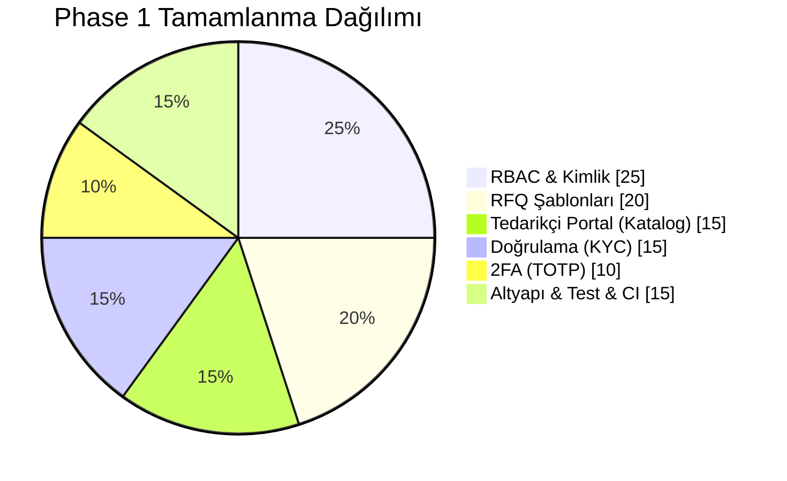
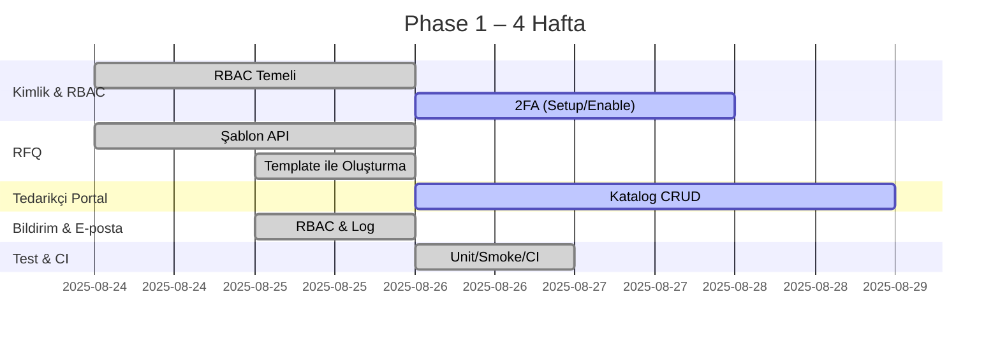

# 📊 Proje Takip Panosu

Bu pano, B2B Agentik projesinin mevcut mimarisini, ilerleme durumunu ve yol haritasını hızlıca görmeyi amaçlar. Görseller sade, teknik ve güncel repo yapısına dayanır.

---

## 🗂️ Proje Klasör Haritası (Özet)

```
.
├─ app/                 # FastAPI backend (main.py, models.py, services/)
│  └─ services/         # Domain servisleri (örn. supplier_discovery.py)
├─ agent_orchestrator/  # Agent orkestratörü (main.py, orchestrator.py, agents.py)
├─ frontend/            # React + Vite + TS (src/, package.json)
├─ supabase/            # SQL migrasyonları (migrations/)
├─ scripts/             # Yardımcı scriptler (start_mock.sh, db_migrate_psql.sh)
├─ docs/                # Dokümantasyon (bu dosya dahil)
├─ docker-compose*.yml  # Yerel ve prod compose dosyaları
├─ Makefile             # Geliştirme komutları
└─ README.md            # Genel proje özeti
```

## 🎯 Son Durum Özeti
- Faz 1 (Core Platform) tahmini ilerleme: ~%70
- Kapsam: RBAC, RFQ Şablonları, Katalog, Doğrulama, 2FA, Util, Test/CI

Görsel durum (anlık, özet):
```
Backend API        [███████████▌     ] 65%
Agent Orchestrator [█████████▏       ] 55%
Frontend (React)   [████████▎        ] 50%
DevOps/CI          [███████████▊     ] 68%
DB/Migrations      [█████████▌       ] 60%
```



> Not: GitHub üzerinde Mermaid görselleri desteklenir; terminal görüntüleyiciler için yukarıdaki ASCII çubukları referans alın.

## 🗺️ Yol Haritası (Faz 1 Gantt)


## 🧱 Mimari Anlık Görünüm
```mermaid
flowchart LR
  FE[Frontend (Vite+React+TS)] -->|/api/v1| BE[FastAPI Backend]
  BE --> SB[(Supabase)]
  BE --> RD[(Redis)]
  BE --> Files[(Uploads)]
  subgraph Özellikler
    RBAC
    RFQTemplates[RFQ Templates]
    Catalog[Katalog]
    Verification[Doğrulama]
    TwoFA[2FA]
    Utils[Utils]
  end
```

ASCII alternatif (hızlı bakış):
```
[Frontend]
   |  HTTP /api/v1
   v
[FastAPI Backend] --(SDK)--> [Supabase]
        |                       ^
        +--(cache/queue)--> [Redis]
        +--(local)-------> [Uploads]
```

## ✅ Tamamlananlar
- RBAC izin matrisi ve endpoint enforcement (RFQ, Offer, Supplier, Email, Notification, Catalog, Verification)
- RFQ Şablonları: listele/getir + şablonla RFQ oluşturma
- Doğrulama (KYC): doküman yükleme + doğrulama talebi, admin onayı
- 2FA (TOTP): setup/enable/disable uçları
- Katalog (supplier_products) CRUD
- Util: döviz kurları ve dönüştürme, lokal dosya upload
- Frontend sayfaları: RFQTemplate, Verification, TwoFactor, Catalog + Navbar ve Router entegrasyonu
- Test & CI: Unit/Smoke testleri, GitHub Actions ile lint+test
- Frontend: Catalog sayfasına kategori/para birimi filtreleri eklendi
- Orchestrate (local): `POST /orchestrate` ve `GET /orchestrate/status/{job_id}` ile basit job akışı
- Backend Testleri: Orchestrate görünürlük testleri eklendi (`/orchestrate/queues`, `/orchestrate/heartbeat`)

## 🔄 Devam Eden
- Katalog sayfası: düzenleme/paginasyon/filtreler (frontend)
- UI geri bildirimleri: zorunlu şablon alanlarını vurgulama, toast bildirimleri
- API entegrasyon testleri (Catalog update/delete, Verification approve)

## ⏭️ Sıradaki Adımlar
- Frontend UX cilası (validasyon, toasts, akış rehberleri)
- Entegrasyon testlerini genişlet (catalog update/delete, verification approve)
- (Opsiyonel) Frontend CI: build + test job

## 🧾 Ayrıntılı Görev Listesi (Subtasks)

Phase 1 – Core Platform
- [x] RBAC izin matrisi ve `require_permission` bağımlılığı
- [x] RFQ şablon servisi ve API (`/rfqs/templates`, `/rfqs/template`)
- [x] RFQ CRUD + publish, currency alanı
- [x] Katalog API (`/catalog/mine|supplier|create|update|delete`)
- [x] Doğrulama talebi (`/verification/request`) + dosya upload (`/utils/upload`)
- [x] Admin doğrulama onayı (`/verification/approve`)
- [x] 2FA uçları (`/auth/2fa/setup|enable|disable`)
- [x] Utilities: currency rates/convert
- [x] Unit/Smoke/Light integration testleri
- [x] Frontend: RFQ şablon sayfası
- [x] Frontend: Doğrulama sayfası
- [x] Frontend: 2FA sayfası
- [x] Frontend: Katalog listesi ve ekleme/silme
- [x] Admin: doğrulama talepleri listesi

Phase 1 – UX ve Test İyileştirmeleri
- [ ] Katalog düzenleme, arama, sayfalama UI cilası
- [ ] Admin panelinde talep satırında onay/ret butonları + toasts
- [ ] Entegrasyon testlerini genişlet (catalog update/delete, verification approve)
- [x] Proje dokümantasyon indeks sayfası (docs/README.md)
- [ ] Doküman içi linkleri `docs/` yapısına göre gözden geçir

Phase 2 – (Ön Hazırlık)
- [ ] Analytics panosu endpoint taslakları
- [ ] Agent workflow testleri ve job-history deposu

## 🧪 İzleme & Çalıştırma
- Komutlar: `make up` (başlat), `make logs`, `make lint`, `make fmt`, `make test-backend`, `make ci`, `make smoke`
- Hızlı test: `pytest -q test_orchestrate_insights.py` (queues/heartbeat)
- Mock mod: `scripts/start_mock.sh` (`.env.mock` + `docker-compose.coolify.yml`)
- CI: `.github/workflows/ci.yml` – push/PR üzerinde lint ve backend testleri
- Sağlık: `GET /health`, API dokümantasyonu: `/docs` (Swagger)
- Reverse proxy: `http://localhost:8080` (API: `/api/*`, UI: `/`)

## ⚠️ Riskler & Bağımlılıklar
- Dış bağımlılıklar: Supabase Erişimi, SMTP servisleri, Redis
- Konfigürasyon: `.env` dosyası (örn. SUPABASE_URL/KEY, SMTP, REDIS_URL)
- Önceliklendirme: Katalog UI cilası ve entegrasyon testleri tamamlanmadan üretim kalitesine geçilmemeli

## 📚 Referanslar
- Roadmap: `B2B_AGENTIK_DEVELOPMENT_ROADMAP.md`
- Mimari: `SYSTEM_ARCHITECTURE.md`
- API: `API_DOCUMENTATION.md`
- Katkı Rehberi: `AGENTS.md`
- Kullanım: `USER_MANUAL.md`
