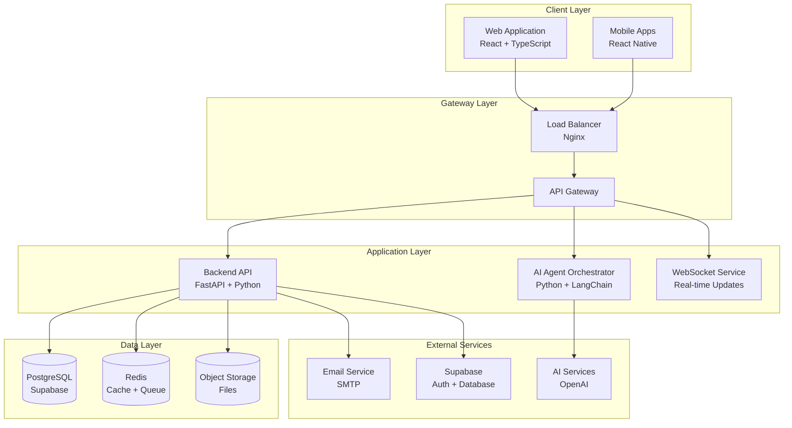

# B2B Agentik Platform - System Architecture Documentation

## Overview

This document provides a comprehensive overview of the B2B Agentik Platform architecture, including system design, component interactions, data flow, and deployment strategies.

**Platform Version:** 1.0.0  
**Architecture Pattern:** Microservices with Event-Driven Architecture  
**Deployment Model:** Containerized with Docker Support  

Repository Layout (current):
```
app/                   # FastAPI backend (source of truth)
frontend/              # React + Vite frontend
agent_orchestrator/    # Agents/worker service
docker-compose*.yml    # Compose files at repo root
Makefile               # Dev commands
```

---

## High-Level Architecture

### System Overview



### Key Architectural Principles

1. **Microservices Architecture**: Loosely coupled, independently deployable services
2. **Event-Driven Design**: Asynchronous communication using Redis pub/sub
3. **API-First Approach**: RESTful APIs with OpenAPI specifications
4. **Scalable by Design**: Horizontal scaling capabilities
5. **Security by Default**: Zero-trust security model
6. **Cloud-Native**: Container-first deployment

---

## System Components

### Frontend Layer

#### React Web Application
```typescript
// Technology Stack
Framework: React 18.x
Language: TypeScript 5.x
Build Tool: Vite
State Management: Redux Toolkit + RTK Query
UI Framework: Material-UI v5
Testing: Jest + React Testing Library
```

**Component Architecture:**
```
src/
├── components/          # Reusable UI components
├── pages/              # Page components  
├── hooks/              # Custom React hooks
├── services/           # API service layer
├── store/              # Redux store
└── types/              # TypeScript definitions
```

### Backend Layer

#### FastAPI Application
```python
# Technology Stack
Framework: FastAPI 0.104+
Language: Python 3.11+
ASGI Server: Uvicorn
ORM: SQLAlchemy 2.0
Validation: Pydantic v2
Authentication: JWT + OAuth2
Testing: Pytest
```

**Service Architecture:**
```
app/
├── api/                # API route handlers
├── core/              # Core business logic
├── models/            # Database models
├── schemas/           # Pydantic schemas
├── services/          # Business logic services
└── tests/             # Test suites
```

#### Key Services

**RFQ Management Service**
```python
class RFQService:
    async def create_rfq(self, rfq_data: RFQCreate) -> RFQ
    async def update_rfq(self, rfq_id: str, updates: RFQUpdate) -> RFQ
    async def search_rfqs(self, filters: RFQFilters) -> List[RFQ]
    async def publish_rfq(self, rfq_id: str) -> RFQ
```

**Supplier Discovery Service**
```python
class SupplierDiscoveryService:
    async def discover_suppliers(self, requirements: dict) -> SupplierSearchResult
    async def analyze_supplier(self, supplier_id: str) -> SupplierAnalysis
    async def generate_recommendations(self, rfq_id: str) -> List[Supplier]
```

### AI Agent Orchestrator

#### Agent Architecture
```python
# Technology Stack
Framework: LangChain + LangGraph
AI Models: OpenAI GPT-4, Anthropic Claude
Task Queue: Celery + Redis
```

**Agent Types:**
1. **Market Intelligence Agent**: Analyzes market trends and pricing
2. **Supplier Matching Agent**: Matches suppliers to RFQ requirements
3. **Risk Assessment Agent**: Evaluates supplier and transaction risks
4. **Document Analysis Agent**: Processes and extracts information from documents

---

## Data Architecture

### Database Design (PostgreSQL via Supabase)

**Core Tables:**
```sql
-- Users and Authentication
users (id, email, role, company_id, created_at, updated_at)
companies (id, name, country, industry, verified, created_at)

-- RFQ Management
rfqs (id, title, description, category, status, buyer_id, created_at)
rfq_specifications (rfq_id, quantity, unit, budget_min, budget_max)

-- Supplier Management
suppliers (id, company_name, contact_person, email, phone, country)
supplier_products (id, supplier_id, product_name, category, price_range)

-- Quotations and Responses
rfq_responses (id, rfq_id, supplier_id, status, submitted_at)
quotation_items (response_id, product_name, quantity, unit_price, total)
```

### Caching Strategy (Redis)

#### Cache Patterns
```python
CACHE_PATTERNS = {
    "user_sessions": {"ttl": 3600, "pattern": "session:{user_id}"},
    "rfq_details": {"ttl": 1800, "pattern": "rfq:{rfq_id}"},
    "supplier_catalog": {"ttl": 7200, "pattern": "catalog:{supplier_id}"},
    "market_data": {"ttl": 14400, "pattern": "market:{category}:{region}"}
}
```

#### Message Queue (Redis Pub/Sub)
```python
CHANNELS = {
    "rfq_created": "events:rfq:created",
    "rfq_updated": "events:rfq:updated", 
    "quote_received": "events:quote:received",
    "user_notifications": "notifications:{user_id}"
}
```

---

## Security Architecture

### Authentication and Authorization

#### JWT Token-Based Authentication
```python
class AuthService:
    async def authenticate(self, credentials: LoginCredentials) -> AuthResult:
        # 1. Validate credentials
        # 2. Check 2FA if enabled
        # 3. Generate JWT tokens
        # 4. Log security event
```

#### Role-Based Access Control (RBAC)
```python
PERMISSIONS = {
    "buyer": [
        "rfq:create", "rfq:read", "rfq:update", "rfq:delete",
        "supplier:read", "quote:read", "order:create"
    ],
    "supplier": [
        "rfq:read", "quote:create", "quote:update",
        "catalog:manage", "profile:update"
    ],
    "admin": ["*"],
    "manager": [
        "rfq:read", "rfq:approve", "user:manage",
        "analytics:read", "report:generate"
    ]
}

def require_permission(permission: str):
    async def _checker(user = Depends(get_current_user_profile)):
        role = user.get("role")
        if role not in PERMISSIONS and "*" not in PERMISSIONS.get(role, []):
            raise HTTPException(status_code=403, detail="Insufficient permissions")
        return True
    return _checker
```

### Data Security

#### Encryption Strategy
```yaml
Encryption at Rest:
  Database: AES-256 (Supabase managed)
  Files: AES-256-GCM (client-side encryption)

Encryption in Transit:
  API: TLS 1.3 (minimum TLS 1.2)
  WebSocket: WSS (WebSocket Secure)
  Internal: mTLS for service-to-service
```

---

## Deployment Architecture

### Containerization Strategy

#### Docker Configuration
```dockerfile
# Multi-stage build for optimization
FROM python:3.11-slim as builder
WORKDIR /app
COPY requirements.txt .
RUN pip install --no-cache-dir -r requirements.txt

FROM python:3.11-slim as runtime
WORKDIR /app
COPY --from=builder /usr/local/lib/python3.11/site-packages /usr/local/lib/python3.11/site-packages
COPY . .
EXPOSE 8000
CMD ["uvicorn", "app.main:app", "--host", "0.0.0.0", "--port", "8000"]
```

#### Production Docker Compose
```yaml
version: '3.8'
services:
  backend:
    build: .
    ports: ["18000:8000"]
    environment:
      - ENVIRONMENT=production
      - SUPABASE_URL=${SUPABASE_URL}
      - REDIS_URL=redis://redis:6379
    depends_on: [redis]
    
  frontend:
    build: ./frontend
    ports: ["13000:80"]
    environment:
      - VITE_API_URL=http://localhost:18000
      
  redis:
    image: redis:7-alpine
    restart: unless-stopped
    
  agent-orchestrator:
    build: ./agent_orchestrator
    environment:
      - REDIS_URL=redis://redis:6379
    depends_on: [redis, backend]
```

### Environment Configuration

```python
class Settings:
    environment: str = "production"
    debug: bool = False
    database_url: str
    redis_url: str
    secret_key: str
    
    # Feature Flags
    enable_ai_features: bool = True
    enable_advanced_analytics: bool = True
    
    # External Service URLs
    supabase_url: str
    supabase_key: str
    openai_api_key: str
```

---

## Scalability and Performance

### Load Balancing
```nginx
# Nginx Configuration
upstream backend {
    least_conn;
    server backend-1:8000 weight=1;
    server backend-2:8000 weight=1;
    server backend-3:8000 weight=1;
}

server {
    listen 80;
    location / {
        proxy_pass http://backend;
        proxy_set_header Host $host;
        proxy_set_header X-Real-IP $remote_addr;
    }
}
```

### Caching Strategy
```python
class CacheManager:
    def __init__(self):
        self.l1_cache = {}  # In-memory (application level)
        self.l2_cache = redis_client  # Redis (distributed)
    
    async def get(self, key: str) -> Optional[Any]:
        # L1 -> L2 -> Database
        pass
```

---

## Monitoring and Observability

### Application Performance Monitoring
```python
# Prometheus Metrics
from prometheus_client import Counter, Histogram, Gauge

rfq_created_total = Counter('rfq_created_total', 'Total RFQs created')
quote_response_time = Histogram('quote_response_time_seconds', 'Quote response time')
active_users = Gauge('active_users_current', 'Currently active users')
```

### Structured Logging
```python
import structlog

logger = structlog.get_logger()

logger.info("RFQ created", 
    rfq_id=rfq.id, 
    user_id=user.id, 
    category=rfq.category,
    request_id=request.headers.get("X-Request-ID")
)
```

### Health Checks
```python
class HealthService:
    async def basic_health(self) -> HealthStatus:
        return HealthStatus(
            status="healthy",
            timestamp=datetime.utcnow(),
            version=app_version
        )
    
    async def detailed_health(self) -> DetailedHealthStatus:
        checks = await asyncio.gather(
            self.check_database(),
            self.check_redis(),
            self.check_external_services()
        )
        return DetailedHealthStatus(checks)
```

---

## API Architecture

### RESTful API Design

#### Endpoint Structure
```
GET    /v1/rfqs                    # List RFQs
POST   /v1/rfqs                    # Create RFQ
GET    /v1/rfqs/{id}               # Get RFQ details
PUT    /v1/rfqs/{id}               # Update RFQ

GET    /v1/rfqs/{id}/responses     # Get RFQ responses
POST   /v1/rfqs/{id}/responses     # Submit response
GET    /v1/suppliers/{id}/catalog  # Get supplier catalog
```

#### Response Format
```json
{
  "success": true,
  "data": {
    "id": "uuid",
    "type": "rfq",
    "attributes": { ... },
    "relationships": { ... }
  },
  "meta": {
    "timestamp": "2024-01-15T10:30:00Z",
    "request_id": "req_123456"
  }
}
```

### WebSocket Real-time Events
```typescript
class WebSocketManager {
  // Event types
  RFQ_UPDATED = 'rfq:updated'
  QUOTE_RECEIVED = 'quote:received'  
  NOTIFICATION = 'notification'
  
  subscribeToRFQ(rfqId: string): void
  subscribeToNotifications(userId: string): void
  broadcastToRoom(room: string, event: string, data: any): void
}
```

---

## Disaster Recovery

### Backup Strategy
```bash
# Automated Database Backup
DB_NAME="agentik_prod"
BACKUP_DIR="/backups/postgresql"
DATE=$(date +%Y%m%d_%H%M%S)

pg_dump $DATABASE_URL | gzip > $BACKUP_DIR/${DB_NAME}_${DATE}.sql.gz
aws s3 cp $BACKUP_DIR/${DB_NAME}_${DATE}.sql.gz s3://agentik-backups/database/
```

### High Availability
```yaml
# Multi-Region Setup
regions:
  primary: "us-east-1"
  secondary: "eu-west-1" 
  disaster_recovery: "us-west-2"
    
failover:
  automatic: true
  threshold: "3_consecutive_failures"
  timeout: "30_seconds"
```

---

## Development Workflow

### Git Workflow
```bash
# Feature Development
git checkout -b feature/rfq-advanced-search
git commit -m "feat: add advanced search filters for RFQs"
git push origin feature/rfq-advanced-search
# Pull Request -> Code Review -> Merge
```

### CI/CD Pipeline
```yaml
# GitHub Actions
name: CI/CD Pipeline
on: [push, pull_request]

jobs:
  test:
    runs-on: ubuntu-latest
    steps:
      - uses: actions/checkout@v3
      - name: Run Tests
        run: |
          pytest tests/
          npm test
  
  deploy:
    needs: test
    if: github.ref == 'refs/heads/main'
    runs-on: ubuntu-latest
    steps:
      - name: Deploy to Production
        run: |
          docker build -t agentik/backend .
          docker push agentik/backend:latest
```

---

## Support and Resources

### Documentation
- [API Documentation](./API_DOCUMENTATION.md)
- [User Manual](./USER_MANUAL.md)
- [Development Roadmap](./B2B_AGENTIK_DEVELOPMENT_ROADMAP.md)
- [Technical Implementation Guide](./TECHNICAL_IMPLEMENTATION_GUIDE.md)

### Contact
- **Technical Support**: dev@agentik.com
- **Architecture Questions**: architecture@agentik.com
- **GitHub Repository**: https://github.com/elkekoitan/B2B.git

---

*Last Updated: January 2024*
*Architecture Version: 1.0.0*
